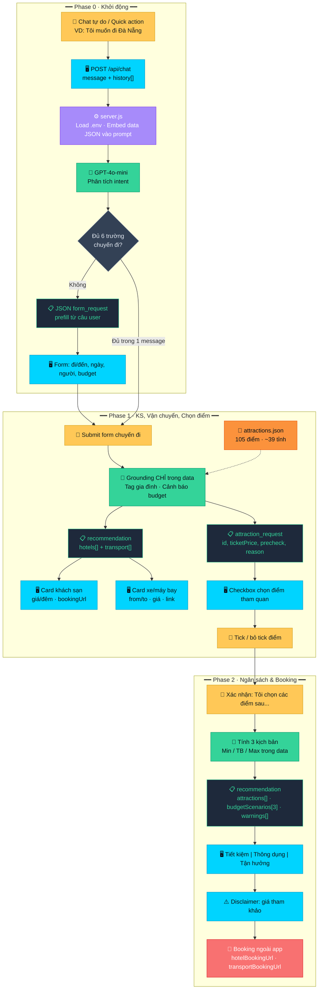
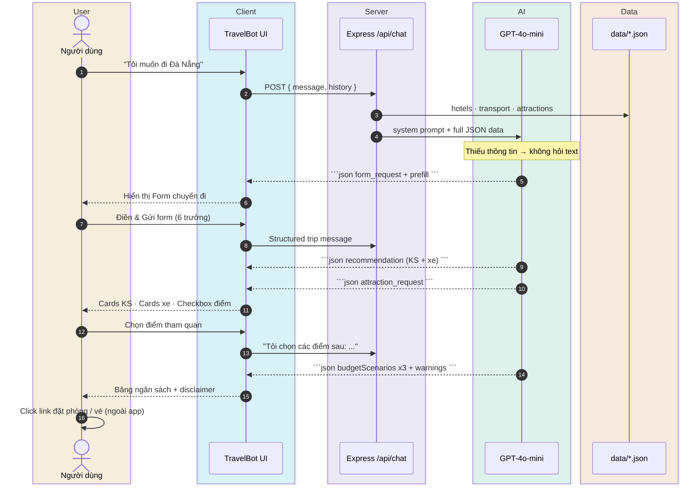
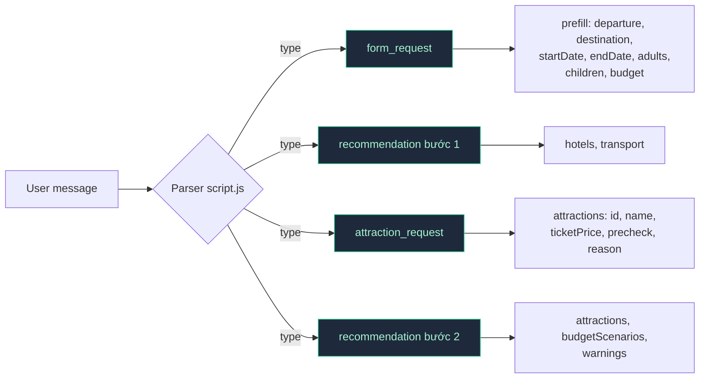
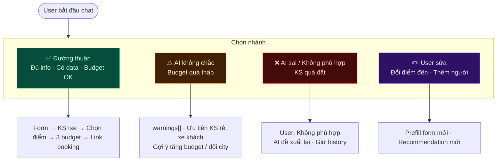
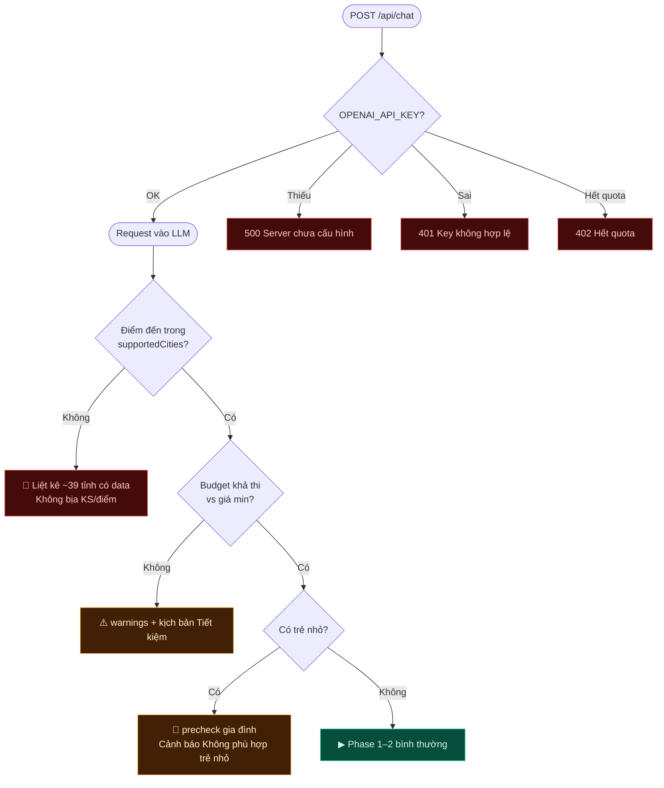
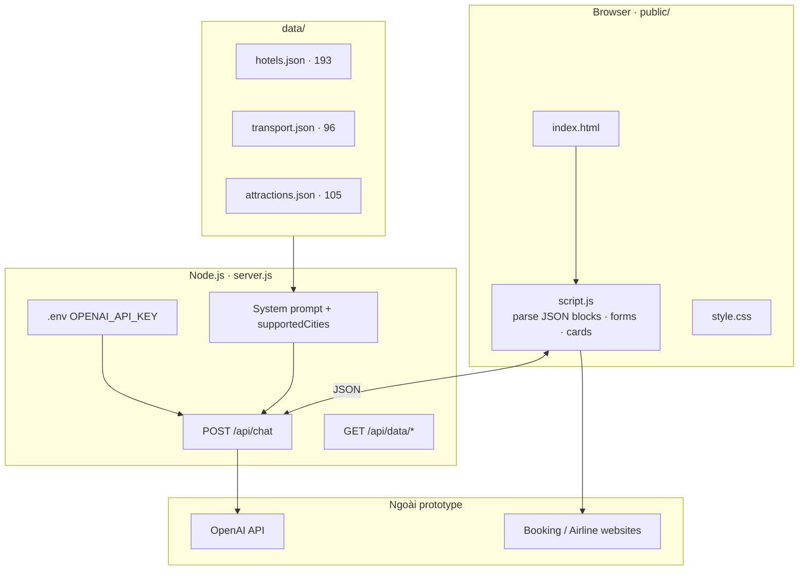
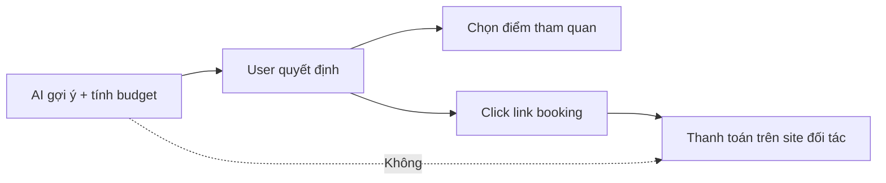

# TravelBot — Flow Diagram (Mermaid)

> Xem trên **GitHub**, **VS Code** (extension Mermaid), hoặc [mermaid.live](https://mermaid.live).  
> File diagram thuần: [`flow.mmd`](./flow.mmd) · Export PNG: `npx @mermaid-js/mermaid-cli -i Flow/flow.mmd -o Flow/flow.png`

---

## 1. Luồng tổng quan (3 Phase)

---

## 2. Sequence diagram — Happy path

---

## 3. JSON contract (luồng dữ liệu)

---

## 4. Bốn đường đi (Trust & UX)

---

## 5. Nhánh lỗi & kiểm soát

---

## 6. Kiến trúc hệ thống

---

## 7. Quyết định Augment (không auto-book)

